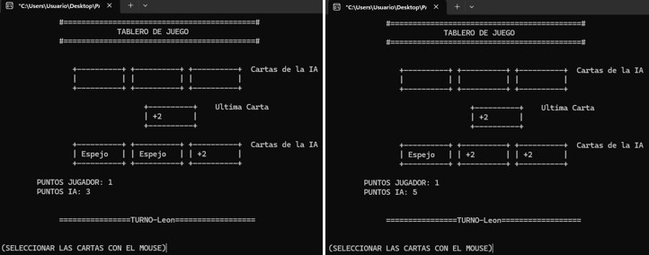
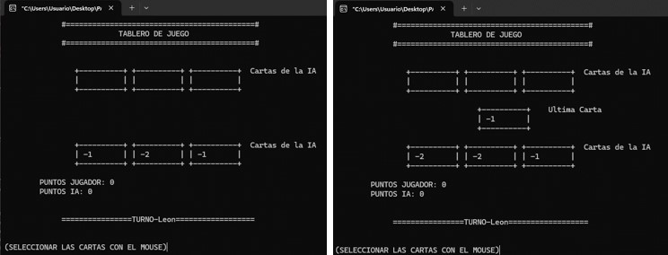
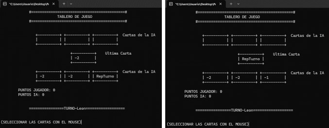
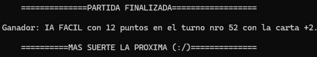
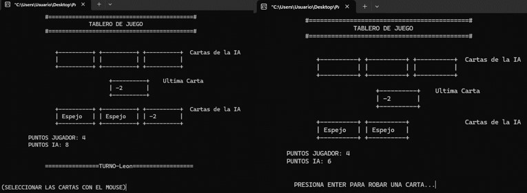
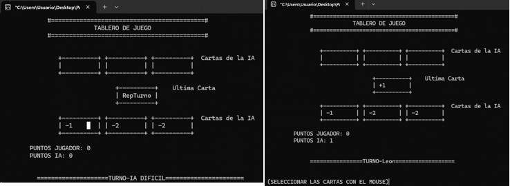
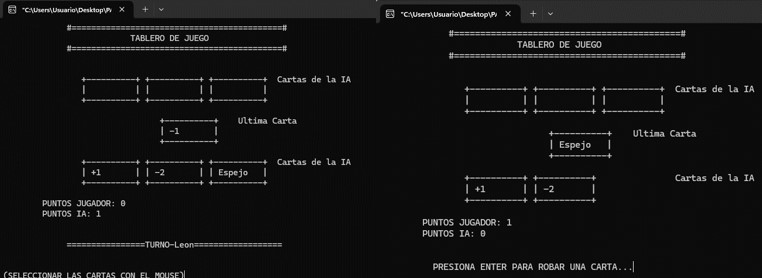
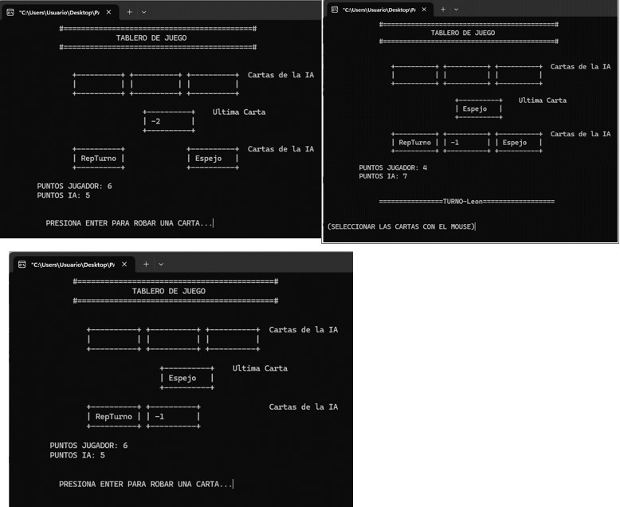
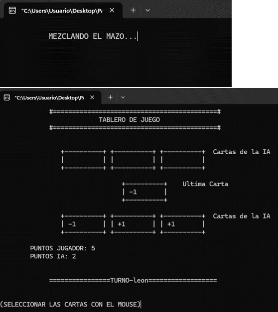

# Trabajo Práctico - Algoritmos y Estructuras de Datos (2025)

## Grupo MAREMOTO (Código MARFIL)
- **Pérez, Thomas Alexander** - DNI: 46425115  
- **Rodríguez, Marcos León** - DNI: 45040212  
- **Díaz, Nicolás** - DNI: 41714473  

---

## Casos de Prueba

### 1) Carta Espejo sin efecto negativo activo
**Descripción:**  
Se quiere probar qué pasaría si en una partida se verifica que ESPEJO no hace nada cuando no hay efecto negativo activo.  

**Entrada:**  
Jugador sin efecto negativo juega ESPEJO  

**Salida esperada:**  
Se espera que, si no contamos con un efecto negativo jugado recientemente, el espejo no tenga efecto.  

**Salida obtenida:**  

---

### 2) Efecto negativo cuando el oponente tiene 0 puntos
**Descripción:**  
Se quiere probar qué pasa si durante una partida se trata de jugar un efecto negativo cuando el oponente tiene 0 puntos.  

**Salida esperada:**  
Se espera que al ejecutar el programa no haya cambios en los puntajes del jugador.  

**Salida obtenida:**  

---

### 3) Repetir turno durante nuestro turno
**Descripción:**  
Se quiere probar qué pasa si durante una partida se juega una carta de repetir turno cuando ya es nuestro turno.  

**Salida esperada:**  
Se espera que el jugador obtenga una nueva carta y luego pueda jugar alguna de las tres.  

**Salida obtenida:**  

---

### 4) Detección de victoria
**Descripción:**  
Se quiere probar si el programa detecta cuando un jugador ha ganado.  

**Salida esperada:**  
Se espera que se muestre por consola el ganador aclarando que ha ganado.  

**Salida obtenida:**  

---

### 5) Aplicación de efecto negativo
**Descripción:**  
Se quiere probar si el programa descuenta los puntos acorde al efecto negativo de la carta jugada.  

**Salida esperada:**  
Se espera que se muestren por consola los puntos descontados al jugador correspondiente.  

**Salida obtenida:**  

---

### 6) IA nivel difícil juega "repetir turno" estratégicamente
**Descripción:**  
Se quiere probar si la IA en nivel difícil detecta que debe usar la carta "repetir turno" a su favor.  

**Salida esperada:**  
Se espera que la IA juegue la carta de repetir y luego use otra carta útil.  

**Salida obtenida:**  

---

### 7) Carta Espejo revierte efecto negativo
**Descripción:**  
Se quiere probar si en la partida al jugar la carta espejo esta revierte el efecto negativo de una carta.  

**Salida esperada:**  
Se espera que el jugador que jugó la carta espejo recupere sus puntos y el otro pierda esa misma cantidad.  

**Salida obtenida:**  

---

### 8) Espejo contra Espejo
**Descripción:**  
Se quiere probar si al jugar la carta espejo, el otro jugador puede contrarrestarla con otra carta espejo.  

**Salida esperada:**  
Se espera que el último jugador que juegue Espejo no reciba efectos negativos, y que el efecto negativo sea revertido al primer jugador.  

**Salida obtenida:**  

---

### 9) Reposición de cartas al acabarse
**Descripción:**  
Se quiere probar si, al quedarse sin cartas durante una partida, el sistema lo detecta y mezcla nuevamente las cartas.  

**Salida esperada:**  
Se espera que se muestre un mensaje por consola y que la partida continúe.  

**Salida obtenida:**  

